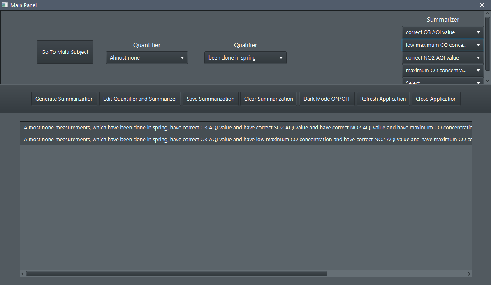
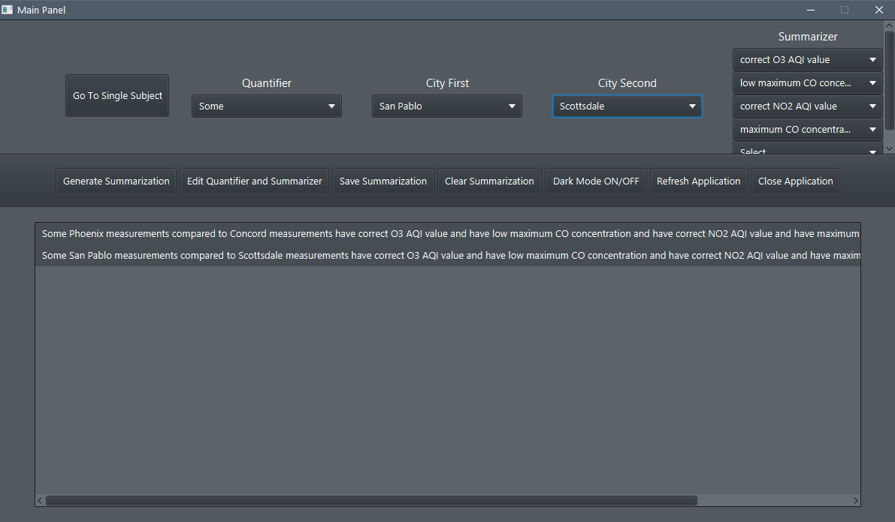
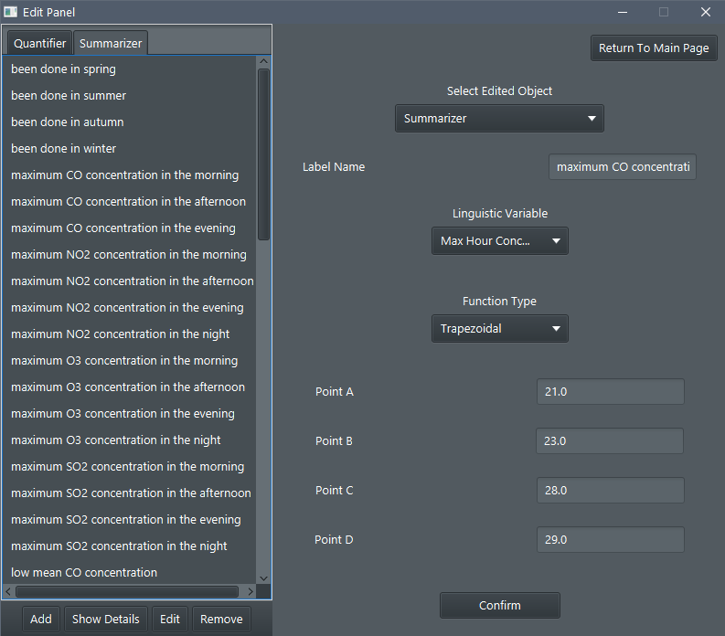

# KSR

### Team Members
* [Jan Karwowski](https://github.com/karwojan)
* [Kamil Kowalewski](https://github.com/KKowalewski24)

## Task 1 - Console App Java SE
`mvn clean package` \
`java -jar <jar-with-dependencies> param1 param2 param3 param4 param5`

##### Call parameters 
    * <percentage of training set (integer 1-99)> 
    * <k for kNN (integer >0)> 
    * <number of keywords (integer >0)>
    * <numerical metric [eucl|manh|cheb]>
    * <text metric [trigram|tfm]>

##### Extra params to remove selected feature:
    * "1",
    * "2,0-50", "2,50-100",
    * "3,0-50,tfidf", 
    * "3,50-100,tfidf", 
    * "3,0-50,tfcitfoc", 
    * "3,50-100,tfcitfoc",
    * "4,0-50,tfidf", 
    * "4,50-100,tfidf", 
    * "4,0-50,tfcitfoc", 
    * "4,50-100,tfcitfoc",
    * "5,0-50,tfidf", 
    * "5,50-100,tfidf", 
    * "5,0-50,tfcitfoc", 
    * "5,50-100,tfcitfoc",
    * "6,0-50,tfidf", 
    * "6,50-100,tfidf", 
    * "6,0-50,tfcitfoc", 
    * "6,50-100,tfcitfoc",

#### Script
Uncomment selected function in main function in `main.py` and run by `python main.py`\
The rest of information is stored in script

## Task 2 - JavaFX Desktop App + Spring Data JPA + PostgreSQL

###### [Dataset](https://www.kaggle.com/sogun3/uspollution) 

###### Database usage
* Install PostgreSQL with JDBC Driver
* Create database `ksr_fuzzy` manually or by using python script in sql-script directory
* Build JAR - `mvn clean package` and the run `java -jar $JAR_NAME$ -sp` to read data from csv file 
and save them into ksr_fuzzy database or restore database from `data-dump.sql` file 
after that run `java -jar $JAR_NAME$ -sl` to create and seed tables for labelWrapper and LinguisticQuantifierWrapper

###### Protip
* Install and create database `ksr_fuzzy` otherwise application with fail to start 
or comment out whole application.properties file - h2 database will be used

##### Call parameters 
* Single param - `seed_pollution` or `-sp` to seed database from csv file
* Single param - `seed_linguistic` or `-sl` to seed database with linguistic data

##### Scipts description
* `filter_data.py` - filtering csv data - removes rows with NaN values, removes selected columns
* `main.py` - script with experiments for report
* `merge_generated_summary.py` - merging results from `main.py`
* `remove_poor_summary.py` - removing merged results from `merge_generated_summary.py` when T1 is below passed value 
* `draw_chart.py` - generating chart for Quantifier
* `generate_function.py` - generating membership function formulas
* `generate_function_to_file.py` - usage of `generate_function.py` with selected params
* `data-dump`- script with dumped data from database after filtering - restore->custom or tar and filename dump-data

```
select no2aqi, date_local
from pollution 
where date_part('month', date_local)>=6
and date_part('month', date_local)<=9
order by no2aqi desc
```

#### Chosen screenshots
<kbd></kbd>
<kbd></kbd>
<kbd></kbd>
